<picture>
  <source media="(prefers-color-scheme: dark)"  srcset="assets/banner.svg">
  <source media="(prefers-color-scheme: light)" srcset="assets/banner.svg">
  
</picture>

<br>

<div align="center">

<table border="0" cellspacing="0" cellpadding="0">
<tr>
<td align="center" width="900">

I'm 19. I build systems that have real detection logic, real inference pipelines, and real forensic output —<br>
not demo dashboards. Things that run in production, surface structure from noise, and generate evidence instead of alarms.

</td>
</tr>
</table>

</div>

<br>


<br>

## &nbsp;About

Self-taught. Depth-first. I work at the intersection of **graph theory**, **machine learning**, and **real-time systems**. Started with Python scripts, ended up building production fraud detection engines, forensic ML pipelines, autonomous robots, and 3D interfaces that make intelligence visible in the browser.

Between the engineering: I think hard about consciousness, the Fermi paradox, and whether the universe is computable. Not as side interests — as a thinking discipline that makes hard technical problems feel tractable.

<br>


<br>

## &nbsp;Systems

<br>

<table border="0" cellspacing="0" cellpadding="16" width="100%">
<tr>
<td valign="top" width="50%">

**[TRANSACTION GRAPH INTELLIGENCE ENGINE](https://github.com/BYTEJAYS/TRANSACTION-GRAPH-ENGINE)**

*Live fraud detection across directed financial graphs · Railway + Vercel*

Every transaction maps onto a directed graph in real time. Six fraud patterns fire simultaneously — circular transfer chains, fan-out smurfing, mule detection, structuring, layering, velocity clustering. Isolation Forest + SHAP scores every node. Verdicts output forensic evidence bundles: JSON + PDF with full BFS propagation traces.

Visualized in 3D. Built to feel like an investigation tool, not a monitoring dashboard.

`Python` · `FastAPI` · `NetworkX` · `scikit-learn` · `SHAP` · `React` · `Three.js` · `WebSocket` · `Docker`

</td>
<td valign="top" width="50%">

**[BLING — BLUE TEAM FORENSIC ENGINE](https://github.com/BYTEJAYS/bling-blue-team)**

*Post-transaction fraud investigation · National Hackathon · Union Bank of India*

Three-tier ML pipeline for settled transactions. Tier 1 exits 78% of clean transactions in 5ms with fast rules. Suspicious cases escalate through graph gate analysis (15ms) → XGBoost with Indian financial context weighting (30ms). Every alert ships with SHAP explanations and a draft Suspicious Transaction Report. No automated blocking — investigators own every decision point.

`Python` · `FastAPI` · `XGBoost` · `PostgreSQL` · `Redis` · `SHAP` · `Docker` · `Alembic`

</td>
</tr>
<tr>
<td valign="top" colspan="2">

**[3D PORTFOLIO](https://github.com/BYTEJAYS/bytejay-portfolio)**

*Interactive 3D portfolio · Next.js 14 · React Three Fiber · Framer Motion*

A browser-native 3D experience with cinematic section transitions, Three.js neural scenes, a skill galaxy, and an ENIAC-1945 boot sequence on load. Built on Next.js 14 App Router with React Three Fiber, Framer Motion, and Tailwind. The kind of portfolio that makes other portfolios feel static.

`Next.js 14` · `React Three Fiber` · `Three.js` · `Framer Motion` · `TypeScript` · `Tailwind`

</td>
</tr>
</table>

<br>


<br>

## &nbsp;Stack

<br>

<div align="center">


<br><br>


<br><br>

<sub>NetworkX &nbsp;·&nbsp; SHAP &nbsp;·&nbsp; XGBoost &nbsp;·&nbsp; Three.js &nbsp;·&nbsp; React Three Fiber &nbsp;·&nbsp; Kafka &nbsp;·&nbsp; ROS2 &nbsp;·&nbsp; Framer Motion &nbsp;·&nbsp; Isolation Forest &nbsp;·&nbsp; GNN</sub>

</div>

<br>


<br>

## &nbsp;Currently

<br>

```
→  Integrating ElevenLabs voice intelligence into TGIE
→  Building AI Sentinel — real-time backend threat detection with PyTorch
→  SLAM research for WALL-E autonomous navigation
→  Reading: graph transformers · neuromorphic computing · computational neuroscience
```

<br>


<br>

## &nbsp;Signals

<br>

<div align="center">


&nbsp;&nbsp;


</div>

<br>

<div align="center">

</div>

<br>


<br>

## &nbsp;On Engineering

I want to build systems that outlive the conversation that created them.

Not features — infrastructure. Not demos — instruments. The through-line in everything I build: **structure from noise**. Fraud patterns hiding in clean-looking transaction data. Anomalies buried in normal request streams. A robot learning the topology of a room it's never seen.

The hard problem is never the model. It's building the infrastructure that makes inference *trustworthy* — the graph engine that holds state under load, the pipeline that doesn't drop edges, the interface that makes a complex verdict readable in two seconds.

Long-term: the boundary where graph intelligence meets neuromorphic computing, where real-time ML meets physical machines, where software and hardware converge into a single discipline. That's the frontier I'm building toward.

The questions I can't answer yet — about consciousness, simulation, the fine-tuned constants — make the ones I can answer sharper.

<br>


<br>

<div align="center">

<sub>
<a href="mailto:codes404z@gmail.com">codes404z@gmail.com</a>
&nbsp;&nbsp;·&nbsp;&nbsp;
<a href="https://linkedin.com/in/bytejay">linkedin.com/in/bytejay</a>
&nbsp;&nbsp;·&nbsp;&nbsp;
Open to research collaborations and ambitious builds
</sub>

<br><br>

</div>
