<h1 align="center">Hi, I'm Jay</h1>

<p align="center">
  
</p>

<p align="center">
  
</p>

<p align="center">
  <a href="https://github.com/BYTEJAYS/TRANSACTION-GRAPH-ENGINE"><code>cd transaction-graph-engine/</code></a>&nbsp;&nbsp;
  <a href="https://github.com/BYTEJAYS/bling-blue-team"><code>cd bling-blue-team/</code></a>&nbsp;&nbsp;
  <a href="https://github.com/BYTEJAYS/bytejay-site"><code>cd bytejay-site/</code></a>
</p>

<br/>

<p align="center">
  
</p>

<br/>

<details>
<summary><code>$ man jay</code> &nbsp;—&nbsp; read the manual page</summary>
<br/>

```text
JAY(1)                        User Manual                        JAY(1)

NAME
    jay — backend developer & AI engineer

SYNOPSIS
    jay [--build backends] [--train models] [--map graphs]

DESCRIPTION
    18-year-old engineer from India who thinks in systems.
    Builds intelligent backends: fraud-detection graph engines,
    local AI companions, and real-time data pipelines.

HISTORY
    age  5   first PC — it never stood a chance
    age 15   writing code, discovered backends and stayed there
    age 17   bug-hunting contests
    age 18   IDEA 2.0 (Union Bank of India) national finalist —
             fraud-detection graph engine

INTERESTS
    guitar(1), singing(1), chess(6), books(∞)

BUGS
    Occasionally forgets to sleep when a graph query gets interesting.

SEE ALSO
    neofetch(1) — scroll up · ls(1) — projects above
```

</details>

<details>
<summary><code>$ sudo hire jay</code> &nbsp;—&nbsp; requires elevated privileges</summary>
<br/>

```text
[sudo] password for recruiter: ········
Access granted.
```

Open to **backend / AI engineering** work — especially anything involving
graph analytics, fraud detection, or real-time systems.

- **email** — [codes404z@gmail.com](mailto:codes404z@gmail.com)
- **linkedin** — [linkedin.com/in/bytejay](https://linkedin.com/in/bytejay)
- **portfolio** — [bytejay-site](https://github.com/BYTEJAYS/bytejay-site)

</details>

<br/>

<p align="center">
  <a href="mailto:codes404z@gmail.com"></a>&nbsp;
  <a href="https://linkedin.com/in/bytejay"></a>&nbsp;
  <a href="https://github.com/BYTEJAYS/bytejay-site"></a>
</p>

<p align="center">
  <sub><code>jay@bytejay:~$ exit</code> — thanks for stopping by</sub>
</p>
